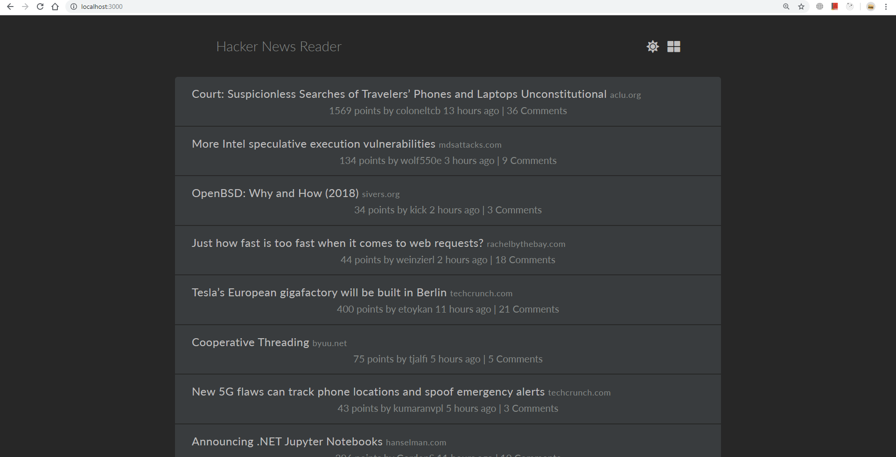

## HACKER NEWS READER

Simple create-react-app project utilizing Hacker News API to render news details with feature to toggle themes and layout.



### Getting Started

Clone repo, install, cd into folder and run:

```bash
npm install
npm start
```

### Languages & Tools

- [React](https://reactjs.org/)
- [Redux](https://github.com/reduxjs/redux)
- [Styled-component](https://www.styled-components.com/)
- [Css grid](https://www.w3schools.com/css/css_grid.asp)
- [Github Page](https://www.npmjs.com/package/gh-pages) for deployment

### Live

https://khuctrang.github.io/news-reader/
